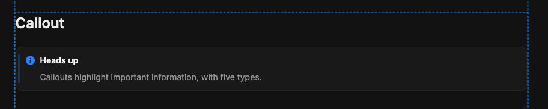
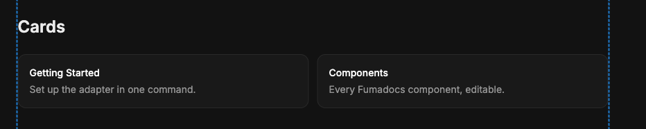
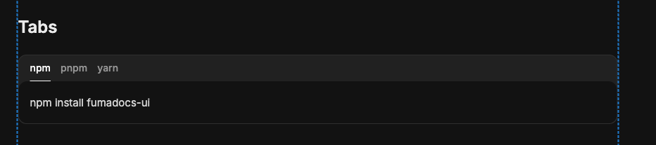
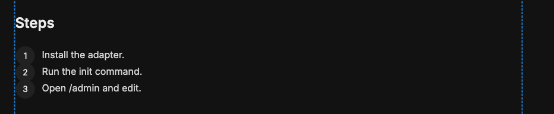
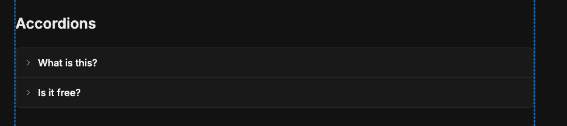
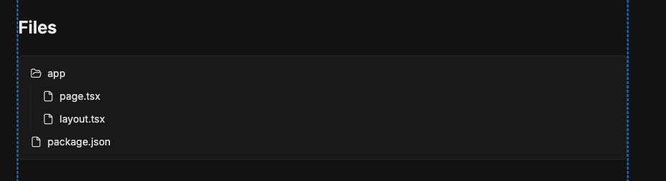
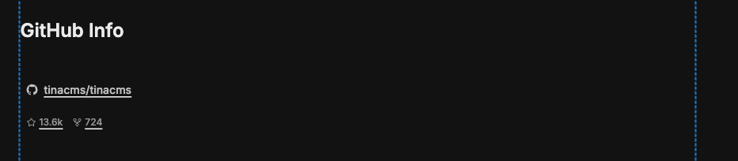
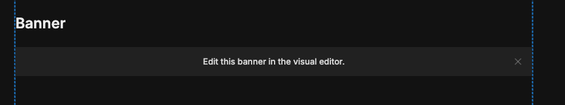
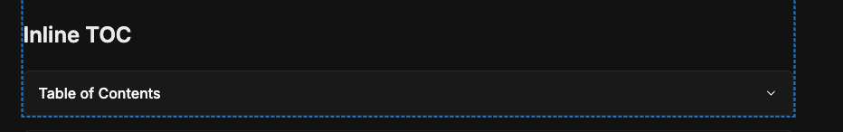

# tinacms-fumadocs-pkg

> [!WARNING]
> **Preview only, not suited for real production use yet.** Official support is coming to TinaCMS (on their [roadmap for v4.1](https://tina.io/roadmap)). For now, explore and prototype, and leave feedback or a 👍 in the [GitHub Discussion](https://github.com/tinacms/tinacms/discussions/6973).

**Visual editing for [Fumadocs](https://fumadocs.dev).** Edit your docs in a clean UI and watch the real Fumadocs components update live as you type. Your `.mdx` files stay the source of truth.

## Quick start

> ⚠️ Use `pnpm`, not `npm`, because npm's strict peer resolution rejects the install.


  ### 1. Create a Fumadocs site

  ```bash
  pnpm create fumadocs-app
  ```
  
  Choose Next.js: Fumadocs MDX, then keep all options at their defaults.

  Move into the generated project:

  ```bash
  cd your-app
  ```

  ### 2. Configure build approvals (only for pnpm v11)

  Before continuing, replace the generated contents of `pnpm-workspace.yaml` with:

   ```yaml
   allowBuilds:
      esbuild: true # Required by Fumadocs MDX and TinaCMS for compilation
      sharp: true # Required by Next.js image processing
      better-sqlite3: true # Required by TinaCMS search indexing
      core-js: false # Library still works; its postinstall only prints funding information
   ```

  Then complete the dependency installation:

  ```bash
  pnpm install
  ```

  pnpm 11 blocks dependency build scripts unless explicitly approved. Without this configuration, the Fumadocs or TinaCMS installation may fail with `ERR_PNPM_IGNORED_BUILDS`.

  ### 3. Initialize TinaCMS

  ```bash
  pnpm dlx @tinacms/cli@latest init
  ```

  Choose `Other` as the framework, `PNPM` as the package manager, then keep the remaining options at their defaults.


  ### 4. Install the Fumadocs adapter

  ```bash
  pnpm dlx github:0xharkirat/tinacms-fumadocs-pkg init
  ```

  ### 5. Start the development server

   ```bash
   pnpm dev
   ```
  Open http://localhost:3000/admin, select a document, and start editing.

## Supported components

Every stock Fumadocs component, editable with a live preview:

### Callout


### Cards


### Tabs


### Steps


### Accordions


### Files


### GitHub Info


### Banner


### Inline TOC


Plus all standard markdown (headings, lists, tables, links, images, and code blocks with real Shiki) and a **`meta.json` sidebar editor** for ordering and grouping pages.

## How it works

The `.mdx` file on disk is the only contract: TinaCMS edits it, Fumadocs renders it. In the editor, the preview compiles your unsaved edit in the browser through Fumadocs' own engine, so you see the **real** components. Production is 100% Fumadocs. Details in [ARCHITECTURE.md](./ARCHITECTURE.md).

<details>
<summary><strong>Manual setup</strong> — skip if you ran <code>init</code></summary>

1. **Install** and transpile:
   ```bash
   pnpm add @tinacms/bridge @tinacms/mdx @mdx-js/mdx @fumadocs/mdx-remote tinacms-fumadocs-pkg
   ```
   ```js
   // next.config.mjs
   export default { transpilePackages: ['tinacms-fumadocs-pkg'] };
   ```
2. **Schema** (`tina/config.ts`): add a `docs` collection with `templates: [...fumadocsTemplates]` (from `tinacms-fumadocs-pkg/templates`) on the body field, and a `meta` collection (`format: 'json'`, `match: { include: '**/meta' }`) for the sidebar.
3. **Components** (`components/mdx.tsx`): spread `fumadocsComponents` (from `tinacms-fumadocs-pkg/components`) into `getMDXComponents`.
4. **Page**: copy `app/docs/[[...slug]]/page.tsx` and `components/tina-live-body.tsx` from the package's [`templates/`](https://github.com/0xharkirat/tinacms-fumadocs-pkg/tree/main/templates).
5. **Scripts**: `dev` = `tinacms dev -c "next dev"`; deploy build = `tinacms build --local -c "next build"`.

</details>

## License

MIT
